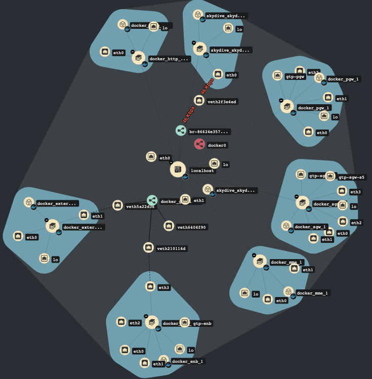

# GW Tester Demo

## Summary

This project provides instructions required to setup the demo
described by *Yoshiyuki Kurauchi* in [this post][1]. The main goal of
this project is to provide an end-to-end implementation of a
Cloud-Native Network Function for didactic purposes.

### Concepts

* **User Equipment (UE):** This is the device that requests
connectivity to the network and downloads/uploads any data.
* **Evolved UMTS Terrestrial Radio Access Network (E-UTRAN):** The
network of antennas or Evolved Node B (EnodeB), gives radio access to
the UE anywhere there is coverage.
* **Public Data Network (PDN):** It is a shared network that is
accessed by users that belong to different organizations.
* **Evolved Packet Core (EPC):** It validates the session request from
the UE, generates a PDP context and gives access to the PDN.
  - *Mobility Management Entity (MME):* It does all the signaling for
the mobile devices but does not process any user data traffic. An MME
will provide session and mobility management for users. In addition,
it tracks the location of the UE and selects the S-GW and P-GW that
should serve this UE.
  - *Serving Gateway (S-GW):* In order to eliminate any effect on user
data while the UE moves between different eNodeBs, the S-GW works as
an anchor point for the user data of the UE, while the UE is moving
between different eNodeBs.
  - *PDN Gateway (P-GW):* This is the node that connects between the
LTE network and the PDN.

### LTE EPC Network Interfaces

* **S1-U:** Interface for S1 user plane data for each bearer between
the EnodeB and S-GW. Provides non guaranteed data delivery
of user plane Protocol Data Units (PDUs).
* **S1-MME:** Responsible for delivering signaling protocols
between the EnodeB and the MME. Consists of a Stream Control
Transmission Protocol (SCTP) over IP. The application signaling
protocol is an S1-AP (Application Protocol).
* **S11:** Interface defined between the MME and S-GW for EPS
management.
* **S5/S8:**: Provides user plane tunneling and tunnel management
function between the S-GW and P-GW. It enables S-GW to connect to
multiple P-GWs for providing different IP services to the UE. Also
used for S-GW relocation associated with the UE mobility. In principle
S5 and S8 is the same interface, the difference being that S8 is used
when roaming between different operators while S5 is network internal.
* **SGi:** Interface is used between P-GW and intranet or internet.

## Setup

This project uses [Vagrant tool][2] for provisioning Virtual Machines
automatically. It's highly recommended to use the  `setup.sh` script
of the [bootstrap-vagrant project][3] for installing Vagrant
dependencies and plugins required for its project. The script
supports two Virtualization providers (Libvirt and VirtualBox).

    curl -fsSL http://bit.ly/initVagrant | PROVIDER=libvirt bash

Once Vagrant is installed, it's possible to deploy the demo with the
following instruction:

    DEPLOY=k8s vagrant up

### Post-provision

Once the Virtual Machine is provisioned by Vagrant, it's possible to
check the logs of the different containers.

    vagrant ssh
    cd /vagrant
    make k8s-logs

### SkyDive

The [Skydive real-time network analyzer][4] can be deployed during the
provisioning process using the `ENABLE_SKYDIVE` environment variable.
Once the services are up and running it's possible to access it thru
the [*8082* local port](http://127.0.0.1:8082).

[1]: https://wmnsk.com/posts/20200116_gw-tester/
[2]: https://www.vagrantup.com/
[3]: https://github.com/electrocucaracha/bootstrap-vagrant
[4]: https://skydive.network/
